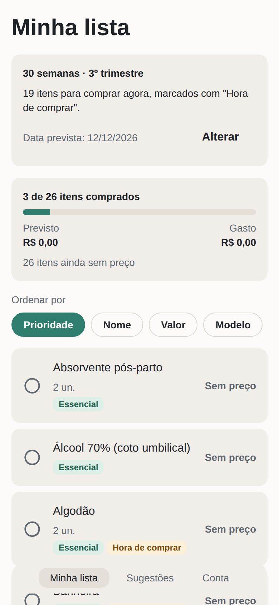
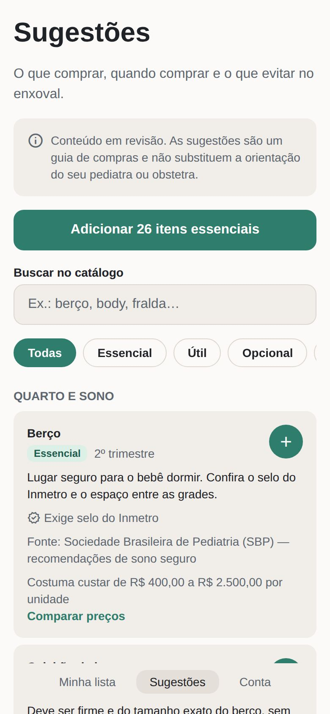
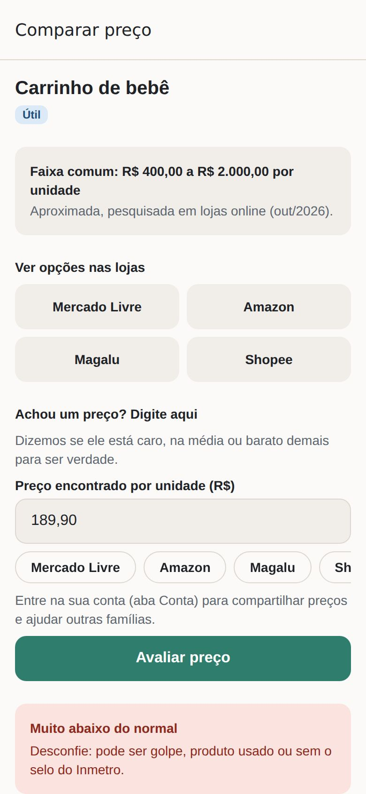
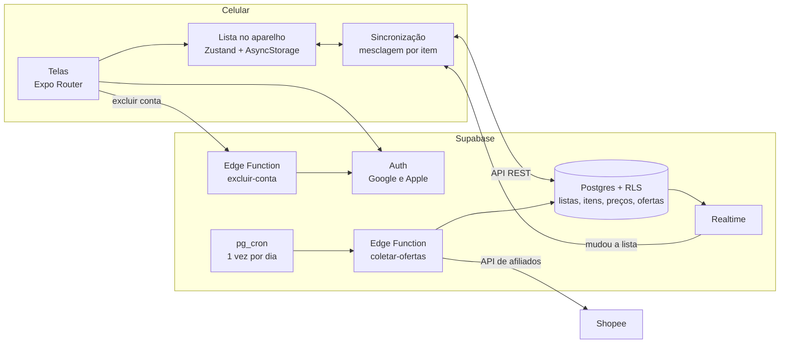

# Enxoval

Aplicativo mobile (Android e iOS) que ajuda a montar o enxoval do bebê:

- sugere o que comprar e indica o que é essencial ou desaconselhado, com fonte oficial;
- organiza a lista de compras com orçamento;
- com a data prevista do parto (guardada só no aparelho), mostra o que já é hora de comprar em
  cada fase da gestação e avisa quando cada fase começa;
- acompanha a gestação semana a semana, com lembretes do pré-natal, sinais de alerta e
  curiosidades, sempre com a fonte e o aviso de que não substitui a consulta;
- guarda a próxima consulta de pré-natal e as perguntas para levar, e avisa na véspera e 2 horas
  antes;
- para cada item, abre a busca nas lojas e diz se um preço encontrado está caro, na média ou
  barato demais para ser verdade;
- com login pelo Google, salva a lista na nuvem e sincroniza entre aparelhos;
- a lista pode ser compartilhada com parceiro e família, com permissões definidas pela gestante,
  e as mudanças aparecem na hora para todos;
- monta a lista de presentes do chá de bebê: os convidados abrem um link, sem instalar nada, e
  marcam o que vão dar, sem repetir;
- a conta pode ser excluída pelo próprio app, com todos os dados dela.

Feito com React Native + Expo (SDK 57), TypeScript e Supabase (login, banco, tempo real e Edge
Functions).

## Telas

<p>
  
  
  
</p>

Capturas da versão web (React Native Web). No celular, as abas são as nativas de cada sistema.

## Destaques técnicos

- **Funciona sem internet:** a lista fica no aparelho (Zustand + AsyncStorage) e sincroniza com
  o Supabase por item, vencendo a alteração mais recente, com remoções lógicas
  (`src/domain/sincronizacao.ts`).
- **Permissões no banco, não só na tela:** RLS por lista, funções auxiliares num esquema que a
  API não publica e um gatilho que impede quem só edita preços de mudar o resto do item.
- **Tempo real:** Supabase Realtime, que respeita o RLS. O app ignora o eco das próprias
  gravações para não sincronizar à toa.
- **Preços informados de forma anônima:** a referência só aparece com 5 pessoas ou mais e usa a
  faixa central (25% a 75%), que resiste a um valor distorcido.
- **Coleta de ofertas:** Edge Function (Deno) que assina as chamadas à API da Shopee e busca 4
  itens por vez. As regras ficam num arquivo puro, testado também no Node.
- **Lista de presentes sem login:** os convidados usam só funções do banco que exigem um código
  secreto de 16 caracteres; quem escolheu fica visível só para a família, e desfazer exige uma
  chave guardada no aparelho do convidado (o banco guarda só o hash).
- **Privacidade:** a data prevista do parto (dado de saúde, LGPD) nunca sai do aparelho, e a
  exclusão de conta apaga tudo em cascata.
- **Testes e CI:** 175 testes do app (Jest e Testing Library) e 43 do banco, que aplicam todas as
  migrações num Postgres local (PGlite) e simulam pessoas pela API. O GitHub Actions roda lint,
  tipos do app e das Edge Functions, Prettier e os testes em cada push.

## Arquitetura



A data prevista do parto e os avisos de fase ficam só no aparelho. A coleta de ofertas está
pronta, mas só liga com a credencial da Shopee ([`docs/ofertas-shopee.md`](docs/ofertas-shopee.md)).

## Como rodar

```bash
npm install
npx expo start
```

Abra o app **Expo Go** no celular (Android ou iPhone) e leia o QR code que aparece no terminal.
O celular e o computador precisam estar na mesma rede Wi-Fi.

Para ver no navegador: `npm run web`.

O `.env` já traz o endereço e a chave pública do Supabase. Para o login funcionar, o Google
precisa estar ativado no projeto: veja [`docs/login-google.md`](docs/login-google.md).

## Scripts

| Comando                         | O que faz                                                                              |
| ------------------------------- | -------------------------------------------------------------------------------------- |
| `npm start`                     | Inicia o servidor de desenvolvimento                                                   |
| `npm test`                      | Roda os testes do app (Jest)                                                           |
| `npm run test:supabase`         | Testa as regras do banco (migrações num Postgres local, PGlite) e da coleta de ofertas |
| `npm run gerar:catalogo-coleta` | Atualiza a lista de itens da coleta de ofertas depois de mudar o catálogo              |
| `npm run lint`                  | Verifica o código com ESLint                                                           |
| `npm run typecheck:funcoes`     | Verifica os tipos das Edge Functions (Deno)                                            |
| `npm run typecheck`             | Verifica os tipos com TypeScript                                                       |
| `npm run format`                | Formata o código com Prettier                                                          |
| `npm run check`                 | Roda tudo acima, como o CI faz em cada push e PR                                       |

## Estrutura

```
src/
  app/          telas (Expo Router: cada arquivo é uma rota)
    (tabs)/     abas: Minha lista, Gestação, Sugestões, Conta
    item/       modais de criar e editar item
    preco/      modal de comparar preço
    presente/   página que os convidados abrem pelo link da lista de presentes (sem login)
  components/   componentes visuais reutilizáveis
  domain/       regras de negócio sem React: catálogo, faixas de preço, avaliação, mesclagem
  nuvem/        Supabase: cliente, login, sincronização, tempo real, compartilhamento e preços
  notificacoes/ avisos locais do começo de cada fase de compras
  store/        estado da lista, da sessão e das referências de preço (Zustand)
  hooks/        hooks de tema e layout
  constants/    cores e espaçamentos
supabase/
  migrations/   estrutura do banco (listas, membros, itens, preços e regras de acesso)
  functions/    Edge Functions (Deno): excluir-conta e coletar-ofertas
  testes/       testes do banco (PGlite) e da coleta de ofertas (npm run test:supabase)
scripts/        geração do catálogo da coleta de ofertas
```

## Documentos

- [`PLANO.md`](PLANO.md) — produto, decisões, fases e riscos.
- [`HANDOFF.md`](HANDOFF.md) — o que já foi feito e o que falta.
- [`docs/login-google.md`](docs/login-google.md) — como ativar o login com Google.
- [`docs/login-apple.md`](docs/login-apple.md) — como ativar o "Entrar com a Apple" (iPhone).
- [`docs/teste-no-celular.md`](docs/teste-no-celular.md) — roteiro de teste no Android e no iPhone.
- [`docs/ofertas-shopee.md`](docs/ofertas-shopee.md) — como ligar as ofertas da Shopee.
- [`docs/publicar.md`](docs/publicar.md) — o que falta para publicar na Google Play e na App Store.
- [`docs/metricas.md`](docs/metricas.md) — consultas de ativação, retenção e uso, sem rastreamento.
